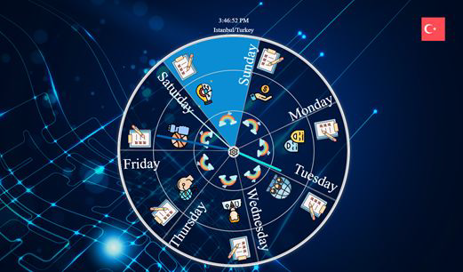
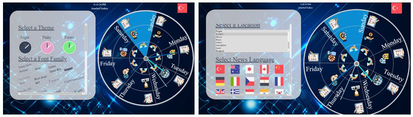
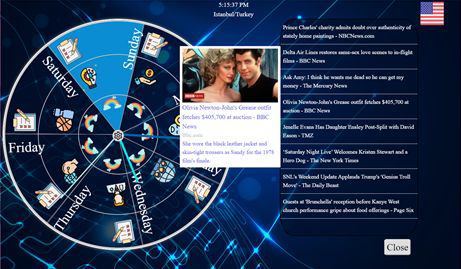
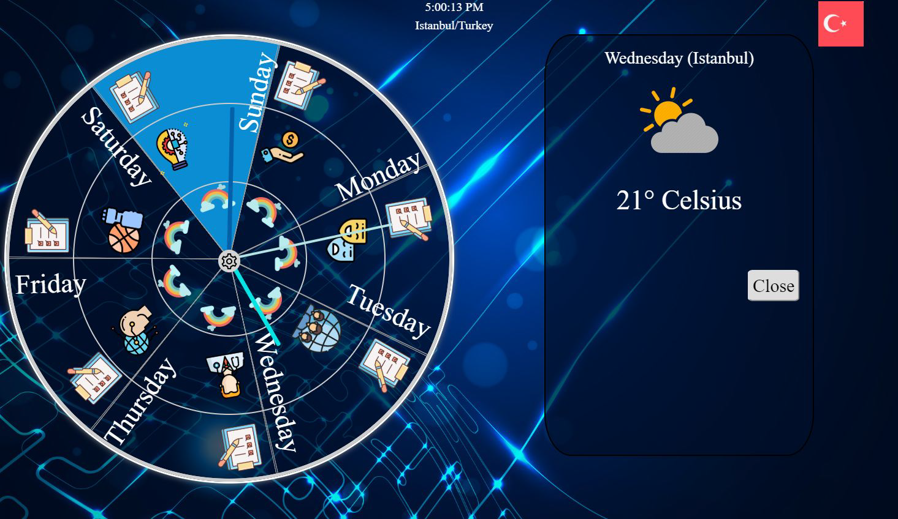
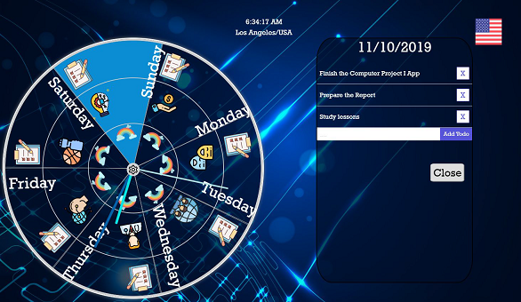

## Brochure
Check brochure of the application -->  [Brochure](Brochure%20of%20the%20Application/README.md)

## Explanation of the Application
People with busy lives have many activities and plans. These people may have to take notes or use a variety of applications in order to remember their plans because in some cases, it may be difficult to remember or keep track of our activities during the day. This project will be developed to find solutions to this problem and make life easier for these people. The aim of this project is to create useful and different interfaces where users can follow their activities, periodic or non-periodic events, meetings, alarms, daily news and weather information. This allows users to save time/improve time management, and to see and follow their plans or news they want to know in one app.

Our application will be a desktop application. We plan to design three or more interfaces. Users will have the freedom to choose the design they want. Each design will have its own unique layout and theme. The shapes, layouts and color intensities of the items may vary. We plan to make interfaces in the form of clock layout. With these clocks, users will be able to follow their weekly activities. We consider the following criteria while creating our application.

1) User preference
2) Integration to external services
3) Ergonomy
4) Periodic and non-periodic events
5) RTC (Real Time Clock)
6) User interface design (objective design options)

## Screenshots from the application:
### Home Page

### Change Theme or Location/Language

### Read Daily News

### Weather Information

### Todo List

## Important Links
For deploying app & For using local storage
* https://github.com/Urucas/electron-packager-interactive/blob/master/README.md
* https://codeburst.io/build-a-todo-app-with-electron-d6c61f58b55a
* https://medium.com/@impaachu/how-to-build-a-react-based-electron-app-d0f27413f17f

## Burak API Key (Highly confidential Top SECRET) 
Check for help http://devnot.com/2019/react-native-ve-hooks-ile-haber-uygulamasi-yapimi-bolum-2/
 * 5193fda464c94330bd8b1ffd48749cef

## Cansu react-open-weather API Key
- Your API key is 58f46e0fda1c1d4da743943c656bcfe3

This project was bootstrapped with [Create React App](https://github.com/facebook/create-react-app).

## Available Scripts

In the project directory, you can run:

### `yarn start`

Runs the app in the development mode. 
Open [http://localhost:3000](http://localhost:3000) to view it in the browser.

The page will reload if you make edits. 
You will also see any lint errors in the console.

### `yarn test`

Launches the test runner in the interactive watch mode. 
See the section about [running tests](https://facebook.github.io/create-react-app/docs/running-tests) for more information.

### `yarn build`

Builds the app for production to the `build` folder. 
It correctly bundles React in production mode and optimizes the build for the best performance.

The build is minified and the filenames include the hashes. 
Your app is ready to be deployed!

See the section about [deployment](https://facebook.github.io/create-react-app/docs/deployment) for more information.

### `yarn eject`

**Note: this is a one-way operation. Once you `eject`, you can’t go back!**

If you aren’t satisfied with the build tool and configuration choices, you can `eject` at any time. This command will remove the single build dependency from your project.

Instead, it will copy all the configuration files and the transitive dependencies (Webpack, Babel, ESLint, etc) right into your project so you have full control over them. All of the commands except `eject` will still work, but they will point to the copied scripts so you can tweak them. At this point you’re on your own.

You don’t have to ever use `eject`. The curated feature set is suitable for small and middle deployments, and you shouldn’t feel obligated to use this feature. However we understand that this tool wouldn’t be useful if you couldn’t customize it when you are ready for it.

## Learn More

You can learn more in the [Create React App documentation](https://facebook.github.io/create-react-app/docs/getting-started).

To learn React, check out the [React documentation](https://reactjs.org/).

### Code Splitting

This section has moved here: https://facebook.github.io/create-react-app/docs/code-splitting

### Analyzing the Bundle Size

This section has moved here: https://facebook.github.io/create-react-app/docs/analyzing-the-bundle-size

### Making a Progressive Web App

This section has moved here: https://facebook.github.io/create-react-app/docs/making-a-progressive-web-app

### Advanced Configuration

This section has moved here: https://facebook.github.io/create-react-app/docs/advanced-configuration

### Deployment

This section has moved here: https://facebook.github.io/create-react-app/docs/deployment

### `yarn build` fails to minify

This section has moved here: https://facebook.github.io/create-react-app/docs/troubleshooting#npm-run-build-fails-to-minify
